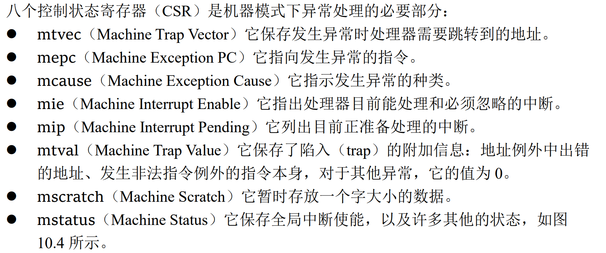

+++
date = '2026-05-16T23:37:23+08:00'
tags = [
"xv6", "risc-v"
]
title = 'xv6-riscv 学习（前言）'
toc = true
+++
> 参考资料：[xv6-riscv book](https://pdos.csail.mit.edu/6.828/2025/xv6/book-riscv-rev5.pdf), [The RISC-V Reader: An Open Architecture Atlas](http://www.riscvbook.com/), [build a os](https://xiayingp.gitbook.io/build_a_os)
## Brief
临近毕业，在写毕设的过程中出于一些原因对xv6 kernel产生了兴趣，故开启此系列blog，希望能够记录自己的学习过程，同时也希望对同样在学习过程中的朋友有一些帮助。  
本文旨在对操作系统进入入口点之前的流程做简单的介绍，暂时不会深入研究某一个模块（毕竟我也才刚开始看），后面对哪个模块感兴趣的话我就会继续写博客。

## XV6-RISCV学习环境的搭建
我使用的代码库是[mit-xv6-riscv](https://github.com/mit-pdos/xv6-riscv)，直接克隆到本地即可。

由于我的计算机架构是x86_64，而这个项目需要riscv，所以需要安装一些交叉工具链（交叉编译工具链以及qemu的riscv版本），我的发行版是debian，所以安装起来比较方便：
```
sudo apt-get install gdb-multiarch qemu-system-riscv\
                     gcc-riscv64-linux-gnu binutils-riscv64-linux-gnu 
```
这个时候就可以直接执行`make qemu`来启动xv6啦。

> 如果显示无法找到对应的交叉编译器的话，可能是TOOLPREFIX变量没有被设置，查看你安装的交叉编译器名称，将gcc前的部分记录下来，执行`make TOOLPREFIX=xxx qemu`即可。


## XV6 内核的加载
xv6-riscv 系统不同于正常的os，为了教学方便，对kernel的加载做了很多简化，首先看Makefile:
```
QEMUOPTS = -machine virt -bios none -kernel $K/kernel -m 128M -smp $(CPUS) -nographic
QEMUOPTS += ...
$K/kernel: $(OBJS) $K/kernel.ld
	$(LD) $(LDFLAGS) -T $K/kernel.ld -o $K/kernel $(OBJS) 
	$(OBJDUMP) -S $K/kernel > $K/kernel.asm
	$(OBJDUMP) -t $K/kernel | sed '1,/SYMBOL TABLE/d; s/ .* / /; /^$$/d' > $K/kernel.sym
```
我们可以知道：xv6使用qemu启动，在`QEMUOPTS`内部可以查看到qemu使用`-kernel`直接将内核镜像加载到内存中，所以也就压根不需要什么OpenSBI或者U-Boot的支持。  
那么它加载到哪里呢？我们可以看到kernel target有一个prerequisite，叫`kernel.ld`，可以看到如下结构：
```
ENTRY( _entry )
...
SECTIONS
{
  . = 0x80000000;

  .text : {
    kernel/entry.o(_entry)
    *(.text .text.*)
    ...
  }
  ...
}
```
可以看到在该链接脚本中，.text为kernel的最低地址段，而.text段为多个代码段的组合，被指定加载到内存地址0x80000000开始的位置；组合中，开头就是entry.o中的\_entry段。  
而qemu virt平台使用`-kernel`显式指定内核时，内核被加载到0x80000000（DRAM起始地址），而恰好入口地址\_entry也是0x80000000。cpu复位后从0x1000执行内置跳转指令，立即跳转到0x80000000，从而开始执行\_entry的第一条指令。
> NOTE：DRAM到0x80000000是qemu virt平台硬编码的内存布局，真实硬件可能有不同之处，但是xv6-riscv遵循此约定，详情请看[qemu-riscv-memory-map](https://github.com/qemu/qemu/blob/master/hw/riscv/virt.c#L103)。

## entry.S
在前面提到，跳转到0x80000000之后cpu会执行\_entry函数的第一条指令，那么我们来分析一下它到底做了啥：
```
.section .text
.global _entry
_entry:
        # set up a stack for C.
        # stack0 is declared in start.c,
        # with a 4096-byte stack per CPU.
        # sp = stack0 + ((hartid + 1) * 4096)
        la sp, stack0
        li a0, 1024*4
        csrr a1, mhartid
        addi a1, a1, 1
        mul a0, a0, a1
        add sp, sp, a0
        call start
spin:
        j spin
```
在汇编中，我们看到里面有一个`hartid`，那么它是做什么的呢？在现实中，risc-v允许一个core（cpu）内部可以存在多个硬件线程，简称hart，而每个hart都有自己的唯一标识，简称hartid，被存放在risc-v中的mhartid状态寄存器中；不过qemu对于hart的模拟貌似不支持这个拓扑，只是简单的模拟为多个core，那我们后面就当hart是core就完事了。

对于hart而言，它是一个独立执行指令流的对象，如果多个hart共享一个栈，那么就会导致数据互相覆盖，程序崩溃，所以必须为每个hart单独设置其栈空间，这也就是\_entry要干的事情。

stack0位于start.c中声明，就是一个CPU数量乘4096bytes的buffer，用于充当栈空间：
```
__attribute__ ((aligned (16))) char stack0[4096 * NCPU];
```
由于xv6的设计中，栈是从高地址向低地址增长的，他们有固定的栈空间上限：4096Bytes。所以每个hart根据其id，可以将栈基地址映射到`stack0 + ((hartid+1)*4096)`处（也就是把计算后的地址赋值给sp寄存器）。

在一顿猛如虎的操作后，我们执行一次call指令，转而执行start函数。

## start.c
在进入下面的模块前，首先要了解一些RISC-V的概念：

### RISC-V 异常与陷阱处理的基本流程
RISC-V具有三种特权级模式，分别为：
- Machine Mode(M-Mode)：M-Mode是RISC-V中hart可执行的最高权限模式，运行在此特权级下的hart对内存、IO等底层功能拥有完全的控制权，这也是唯一所有标准RISC-V处理器都必须实现的模式。
- Supervisor Mode(S-Mode)：一种可选的模式，S-Mode介于M-Mode和U-Mode之间，旨在支持现代类Unix操作系统。
- User Mode(U-Mode)：最低特权级，用于运行用户进程，旨在保护系统免受不可信代码的危害，并且为不受信任的进程提供隔离保护。可以理解为x86中的ring3。

通常来说RISC-V核心在上电启动时处于M-Mode，在这个模式下，最重要的一个特性就是拦截和处理异常。

RISC-V将异常分为：
- __同步异常__：指令执行期间产生，如无效opcode或者无效RAM地址。
- __中断__：与当前指令流异步的外部事件，比如键盘敲击，鼠标点击等等IO事件。

而RISC-V对于陷阱（trap）有独特的定义：由异常导致控制流转移到陷阱处理程序的**过程**。  

在了解异常的处理流程之前，我们先得了解一些寄存器，这里给出rvbook的定义：
<p class="imgp">

</p>

而mstatus中有三个很重要的位域：__MPP__，这个位域存放的是陷入前hart所处的模式，也就是后续mret返回的模式；__MIE__，作用于M-Mode的中断全局使能；__MPIE__，保存陷阱发生前活动的中断使能的值。

当一个hart陷入时，硬件会自动做如下动作：
1. hart停止当前的指令流，将pc设置为mtvec的地址，随后进入M-Mode。
2. 将异常信息记录到mcause，将附加异常信息记录到mtval。
3. 将指令地址写入mepc（对于同步异常，mepc记录发生异常的指令地址；对于中断，mepc记录触发异常的指令的下一条指令地址）。
4. 更新mstatus：将MIE设置为0以禁用中断，然后把先前的MIE值保存在MPIE中，随后将MPP设置为触发异常的特权级。

在执行完陷阱处理程序后，软件就会执行mret指令（M-Mode特有）进行中断返回，mret将pc设置为mepc的值，将mstatus中的MPIE复制给MIE来恢复中断使能，并且将特权级设置为MPP。

由于根据RISC-V的设计，所有陷阱默认都由M-Mode代理，然而操作系统通常运行在S-Mode下，如果按照默认情况来的话，那么就会先去M-Mode，然后再mret退回到S-Mode进行处理，但是这明显多此一举，我们想要一些陷阱直接陷入S-Mode下交给操作系统进行处理，那这个时候就引入了RISC-V的陷阱委派机制。

### RISC-V 陷阱委派机制
medeleg/mideleg CSR控制将哪些同步异常/中断委托给S-Mode，medeleg/mideleg中的每个位就和mie和mip一样，标识每种异常。如果把bitx置位，那么bitx所代表的同步异常/中断就会被移交S-Mode的异常处理程序，而不用经过M-Mode。这时就不用再访问那些M-Mode的CSR啦，把上面提到的所有CSR的前缀改成s就ok了（比如mtvec改成stvec），其他都是同样的操作。
> 但是要注意，如果在发生被委托到S-Mode的异常的时候，hart处于M-Mode下，那么这个异常就不会被委托给S-Mode，而是交由M-Mode处理；但是如果一个异常被代理给了同等特权级（比如在S-Mode模式下发生了异常，但是这个异常同样被代理给了S-Mode），那么进行处理的还是S-Mode。

### start函数：进入入口点的临界函数
在了解了上面的一些知识以后，再看start就属于是降维打击了，我们逐个操作来看：

```
{ ...
  // set M Previous Privilege mode to Supervisor, for mret.
  unsigned long x = r_mstatus();
  x &= ~MSTATUS_MPP_MASK;
  x |= MSTATUS_MPP_S;
  w_mstatus(x);
}
```
> `r_mstatus`和`w_mstatus`这两个函数针对mstatus进行读和写，采用内联RV64汇编的形式完成，后续发生`r_xcsr/w_xcsr`的操作的时候，和这俩函数的结构相差无几。

这个操作很简单，首先我们现在还处于M-Mode下，所以对M-Mode的CSR的读写是被允许的，这里我们读出mstatus后，将MPP位设置为S-Mode（MSTATUS\_MPP\_S）然后写回，这样我们后续退出start函数时执行mret就会将我们的特权级设置为S-Mode（也就是xv6-riscv kernel运行的特权级）。

```
{ ...
  // set M Exception Program Counter to main, for mret.
  // requires gcc -mcmodel=medany
  w_mepc((uint64)main);
}
```
这个操作就是设置mepc的值，我们上面提到在陷阱处理程序返回的时候会将pc值设置为mepc，这里将mepc的值设置为main函数的地址（因为是RV64实现，所以是64位地址），后续mret的时候就能正确的跳过去了。

```
{ ...
  // disable paging for now.
  w_satp(0);
}
```
satp是处于S-Mode的CSR之一，是MMU的开关和配置中心，负责开启/关闭分页功能和设置根页表的位置。我们现在完全不用关心其内部的结构，因为在操作系统main入口点调用kvminit()之前，内核还没有有效的页表，此时任何虚拟地址的访问都将发生错误，将satp设置为0可以暂时禁用虚拟地址的访问，这样就可以保证从这里到kvminit()函数之间，hart发出的所有地址的访问都是对物理地址的访问。

```
{ ...
  // delegate all interrupts and exceptions to supervisor mode.
  w_medeleg(0xffff);
  w_mideleg(0xffff);
  w_sie(r_sie() | SIE_SEIE | SIE_STIE);
}
```
这里就是所谓陷阱委托机制的使用处，我们将medeleg和mideleg寄存器所有位设置为1，表示所有的异常都移交给S-Mode代理。然后我们向sie寄存器写入`SIE_SEIE`和`SIE_STIE`来开启外部中断和定时器中断的支持，这样发生这两个中断的时候就能被S-Mode正确处理了。  
不过这里貌似没有开启软件中断代理（SSIE），不知道是为啥，还需要进一步弄明白。

```
{ ...
  // configure Physical Memory Protection to give supervisor mode
  // access to all of physical memory.
  w_pmpaddr0(0x3fffffffffffffull);
  w_pmpcfg0(0xf);
}
```
RISC-V设计有一种物理内存保护机制（PMP）来对S-Mode下的内存访问做限制，如果启用，就会导致S-Mode仅能访问他们被允许访问的一块内存。但是xv6不在乎这一点，在这里他简单的禁用掉了PMP特性，给了S-Mode访问所有物理内存空间的权限。  
其实不了解这个也无所谓，我们后面也没用到这个特性，暂时不管他了，挖个坑后面有机会再填。

```
{ ... // start()
  // ask for clock interrupts.
  timerinit();
}
// reference: ask each hart to generate timer interrupts.
void timerinit()
{
  // enable supervisor-mode timer interrupts.
  w_mie(r_mie() | MIE_STIE);
  // enable the sstc extension (i.e. stimecmp).
  w_menvcfg(r_menvcfg() | (1L << 63)); 
  // allow supervisor to use stimecmp and time.
  w_mcounteren(r_mcounteren() | 2);
  // ask for the very first timer interrupt.
  w_stimecmp(r_time() + 1000000);
}

```
按照老的的RISC-V设计，时钟中断是M-Mode模式下的本地中断，S-Mode无权响应，也无法通过mideleg进行代理，比较巧妙的解决方案是通过在M-Mode的中断处理函数里面显式触发一个S-Mode的软中断，从而让S-Mode能够看得到时钟。

但是抱歉，时代变了，RISC-V引入了SSTC拓展，可以在S-Mode下产生STI（Supervisor Timer Interrupt），这样就不用那么蹩脚了。我们来看下timerinit里面的做法吧：
1. 先对mie中的STIE置位。说实话我不清楚为啥要做这个，根据RISC-V ISA volume II第121页，sip/sie是mie/mip的受限视图，对sie/sip的读写都会导致一次mie/mip的相同的读写。这句代码完全没用啊。我在github上也找到了相关的[issue](https://github.com/mit-pdos/xv6-riscv/issues/422)，难道那群小老头搞错了？
2. 对menvcfg的最高位stce置位，开启sstc支持。现在在S-Mode下就可以产生对应的STI啦。
3. 对mcounteren的bit1（TM）进行置位来启用S-Mode下对time类寄存器的读取，如果不这样做的话，S-Mode下尝试对time/stimecmp寄存器进行读取就会触发非法指令异常。
4. 在完成上面的步骤之后，就可以发出一次始终定时啦，可以通过写入stimecmp进行定时，stimecmp的工作原理是：如果`time >= stimecmp`，那么就立即设置sip.STIP，表示一个定时器中断已经触发。不过为啥要隔1000000个时钟周期呢？我还没搞清楚诶。

好了，接下来回到start():
```
{ ...
  // keep each CPU's hartid in its tp register, for cpuid().
  int id = r_mhartid();
  w_tp(id);

  // switch to supervisor mode and jump to main().
  asm volatile("mret");
}
```
现在做的工作就非常简单了，首先每个hart从mhartid读取自己的hartid，然后把它赋值给tp寄存器，来标识自己是哪个hart，但是我们上面也说了，由于qemu virt的特殊性，我们就当hart是core，从这个注释来看，他们也是这么想的。

随后内联一个mret汇编指令，执行中断返回，此时我们的特权级转换到S-Mode，pc设置为main函数的地址，从此开始正式的kernel boot流程。

## 总结
蛮奇特的一次体验，开始学习前还以为是简单的看看代码，最多分析下汇编，本来没想要做太多研究的，结果走了一段，发现需要查阅这么多资料才能勉强弄明白代码做的事情，不过也很开心，很有意思的学习过程，也希望后面的坑也都这么好玩哈哈。
